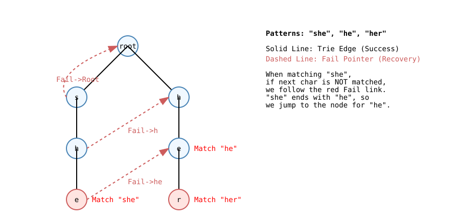

# AC Automaton (Aho-Corasick) | AC 自动机

[English Version](#english-version) | [中文版本 ](#中文版本)

---

## English Version

### 1. Problem and Motivation
Given a text $T$ and a dictionary of patterns $P_1, P_2, \dots, P_k$, report all matches of all patterns in one pass.

Typical scenarios:
- Sensitive-word filtering
- DNA motif search
- Intrusion signature scanning
- Search-engine query highlighting

If we run KMP/BM for each pattern independently, total cost is often near $O(|T|\cdot k)$ in practice. AC automaton merges all patterns into one machine and scans once.

### 2. Big Picture (Intuition First)
AC automaton = **Trie + failure links + output links**.

- Trie gives the “best possible forward match”.
- Failure link tells where to continue when forward match breaks.
- Output information tells which patterns end at current state.

Think of this as a GPS rerouting system:
- Green road: keep matching (Trie edge)
- Red dashed road: mismatch fallback (fail edge)
- You never drive backward on text index

### 3. Formal Model
Let each Trie node be a state $u$.

- `next[u][c]`: transition by character $c$
- `fail[u]`: longest proper suffix state of current matched string
- `out[u]`: list/count of patterns ending at state $u$

For any state $u$ and char $c$, deterministic transition in query phase is:

$$
u \leftarrow next[u][c]
$$

where missing transitions are pre-filled during BFS using fail transitions, so query becomes O(1) transition per character.

### 4. Build Procedure (Layer by Layer)

#### Step A: Insert all patterns into Trie
For each pattern, walk/create nodes and increment endpoint marker.

#### Step B: BFS to build `fail`
1. Root children get `fail = root`.
2. Pop state `u` from queue.
3. For each character `c`:
     - If `v = next[u][c]` exists:
         - `fail[v] = next[ fail[u] ][c]`
         - merge outputs: `out[v] += out[ fail[v] ]`
         - push `v`
     - Else:
         - `next[u][c] = next[ fail[u] ][c]` (automaton completion)

This “completion” is crucial: query no longer needs `while(fail...)` loops.

### 5. Query Procedure (One Pass)
Initialize `u = root`.

For each text character `ch`:
1. `u = next[u][ch]`
2. Add/report `out[u]`

If you need exact pattern IDs, store vector/list of IDs at each endpoint and traverse merged output list.

### 6. Why It Is Linear
After completion, each text character performs one table lookup and one state move.

Total:
- Build: $O(\sum |P_i| + \Sigma \cdot \text{states})$ for dense alphabet table
- Query: $O(|T| + \#matches)$

For fixed alphabet (e.g., lowercase 26), this is effectively linear.

### 7. Practical Implementation Patterns

#### Pattern A: Counting total matches only
- `out[u]` as integer count
- merge with `out[fail[u]]`
- fastest and memory-friendly

#### Pattern B: Distinct pattern frequency
- store endpoint pattern index
- in query accumulate counts for each index

#### Pattern C: First occurrence positions
- when visiting state at text index `i`, each matched pattern `p` ends at `i`, starts at `i-|p|+1`

### 8. Common Pitfalls
1. Forgetting to merge output along fail links (`out[v] += out[fail[v]]`).
2. Not completing missing transitions, causing slower query loops.
3. Mixing character sets (ASCII/Unicode) without alphabet mapping.
4. Double counting when “visited-state prune” is used in count-all tasks.
5. Using recursive DFS for huge Trie (risk stack overflow); BFS is safer.

### 9. Tiny Example
Patterns: `he`, `she`, `her`.
Text: `ushers`.

Scan result contains:
- `she` at `[1..3]`
- `he` at `[2..3]`
- `her` at `[2..4]`

This overlap handling is exactly why AC is stronger than naive repeated search.

### 10. Engineering Notes
- For alphabet size 26, prefer fixed array `next[26]` for speed.
- For large alphabet, use hash map transitions to save memory.
- For million-level states, pre-allocate vectors (`reserve`) to reduce reallocations.

---

## 中文版本 

### 1. 问题与动机
给定文本 $T$ 和模式串集合 $P_1,P_2,\dots,P_k$，要求一次扫描找出所有模式串的出现位置。

典型场景：
- 敏感词过滤
- 病毒特征匹配
- DNA 片段检索
- 搜索引擎高亮

如果每个模式串分别跑 KMP，总体成本通常接近 $O(|T|\cdot k)$。AC 自动机把多个模式串合成一台状态机，实现“一趟文本扫描”。

### 2. 直觉图景（先理解，再公式）
AC 自动机 = **Trie + Fail 指针 + 输出信息**。

- Trie：尽量向前匹配
- Fail：匹配失败时跳到“次优但仍有效”的状态
- 输出：当前状态对应哪些模式串命中

可把它想象成导航系统：
- 绿色道路：继续前进（Trie 边）
- 红色虚线：快速绕行（Fail 边）
- 文本指针永不后退

### 3. 形式化定义
把 Trie 每个节点当作状态 $u$。

- `next[u][c]`：读入字符 $c$ 后的转移
- `fail[u]`：当前字符串的最长真后缀状态
- `out[u]`：在状态 $u$ 结尾的模式串信息

查询阶段统一写成：

$$
u \leftarrow next[u][c]
$$

因为缺失边会在 BFS 构建时补齐，所以查询不需要回退循环。

### 4. 构建流程（层层推进）

#### 步骤 A：插入模式串
逐字符插入 Trie，并在终止节点打上终止标记（计数或 ID 列表）。

#### 步骤 B：BFS 构建 Fail
1. 根的孩子 `fail = root`
2. 队列弹出状态 `u`
3. 遍历字母 `c`：
     - 若存在 `v = next[u][c]`：
         - `fail[v] = next[fail[u]][c]`
         - 输出继承：`out[v] += out[fail[v]]`
         - 入队 `v`
     - 否则：
         - `next[u][c] = next[fail[u]][c]`

这一步把“树”补成了“自动机图”。

### 5. 查询流程（一趟文本）
初始化 `u = root`。

对于文本每个字符 `ch`：
1. `u = next[u][ch]`
2. 累加/输出 `out[u]`

若要精确报告每个单词位置，存储模式串长度即可用 `end = i, start = i-len+1` 恢复区间。

### 6. 复杂度来源

- 构建：$O(\sum |P_i| + \Sigma \cdot \text{states})$
- 查询：$O(|T| + \#matches)$

对固定字母表（如 26 个小写字母）可视作线性复杂度。

### 7. 实战实现形态

#### 形态 A：只统计总命中数
- `out[u]` 用整数
- 速度最快，内存也省

#### 形态 B：统计每个模式串次数
- 终点节点保存模式串编号
- 查询时给对应编号累加

#### 形态 C：输出全部位置
- 命中时记录结束下标
- 结合模式串长度反推起点

### 8. 常见坑点
1. 忘记把 `out[fail[v]]` 合并到 `out[v]`。
2. 没补齐缺失转移，导致查询阶段退化。
3. 字符集映射错误（大小写、ASCII、Unicode 混用）。
4. 去重逻辑写错导致漏报或重复报。
5. 极大数据下未预分配容量，频繁扩容导致 TLE。

### 9. 小例子
模式串：`he`, `she`, `her`；文本：`ushers`。

命中：
- `she` 在 `[1..3]`
- `he` 在 `[2..3]`
- `her` 在 `[2..4]`

这体现了 AC 自动机处理重叠匹配的优势。

### 10. 工程建议
- 小字母表用定长数组 `next[26]`（快）。
- 大字母表用哈希表（省内存）。
- 大规模节点提前 `reserve`。
- 若仅需判存在，可遇到首个命中提前结束。

---

[回到顶部 / Back to Top](#ac-automaton-aho-corasick--ac-自动机)