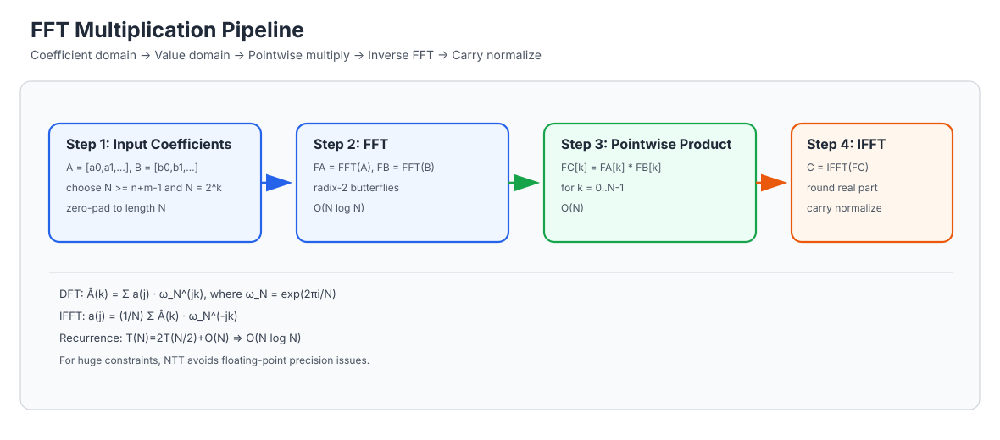
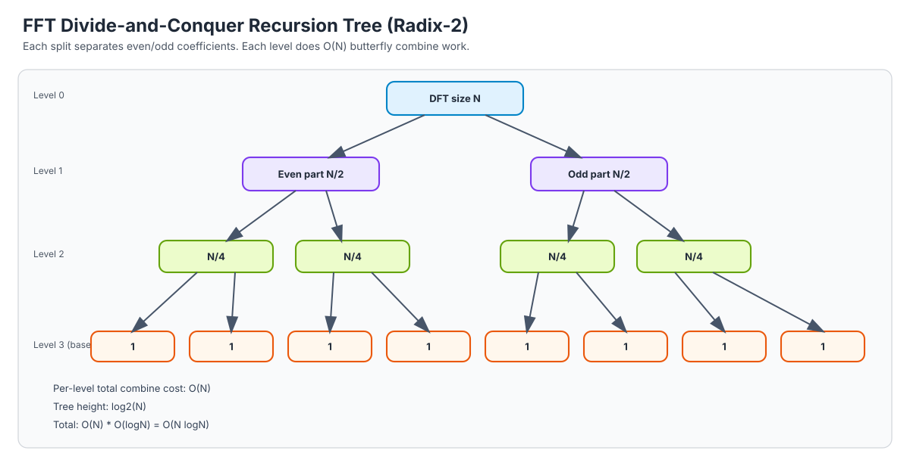

# Polynomial Multiplication Notes (FFT + Karatsuba) | 多项式与大整数乘法深度笔记

[English Version](#english-version) | [中文版本](#中文版本)

---

## English Version

### 1. Problem Setup
We want to multiply two very large integers / polynomials efficiently.

Given:

$$
A(x)=\sum_{i=0}^{n-1}a_i x^i,\quad B(x)=\sum_{j=0}^{m-1}b_j x^j
$$

Their product:

$$
C(x)=A(x)B(x),\quad c_k=\sum_{i+j=k}a_i b_j
$$

Naive convolution costs `O(nm)`.

### 2. Where FFT Fits
Convolution in coefficient domain becomes pointwise multiplication in value domain:

1. Evaluate `A, B` at many points.
2. Multiply values pointwise.
3. Interpolate to recover coefficients.

FFT chooses points as roots of unity, making both evaluation and interpolation `O(N log N)`.

### 3. The Mathematical Core

#### 3.1 DFT definition
For length `N` (power of 2), primitive root

$$
\omega_N=e^{2\pi i/N}
$$

DFT:

$$
\hat a_k=\sum_{j=0}^{N-1}a_j\omega_N^{jk}
$$

Inverse DFT:

$$
a_j=\frac{1}{N}\sum_{k=0}^{N-1}\hat a_k\omega_N^{-jk}
$$

#### 3.2 Divide-and-conquer decomposition
Split even/odd terms:

$$
A(x)=A_{even}(x^2)+xA_{odd}(x^2)
$$

Then for $x = \omega_N^k$:

$$
A(\omega_N^k)=A_{even}(\omega_{N/2}^k)+\omega_N^kA_{odd}(\omega_{N/2}^k)
$$

This is exactly the butterfly merge.

#### 3.3 How the recursion tree reduces work
At level `0`, one size-`N` problem.
At level `1`, two size-`N/2` subproblems.
At level `2`, four size-`N/4` subproblems, and so on.

At each level, total combine work remains `O(N)`.
Number of levels is `log_2 N`.
Therefore total is `O(N log N)`.

### 4. Step-by-Step FFT Multiplication
1. Convert digits/coefficients to arrays.
2. Choose `N` as power-of-two with `N >= n+m-1`.
3. Zero-pad both arrays to `N`.
4. FFT(A), FFT(B).
5. Pointwise multiply.
6. IFFT to recover coefficients.
7. Round (for floating-point FFT), then carry normalize for integer multiplication.

#### Butterfly operation (one merge frame)
For each `k in [0, N/2)`:

$$
t = \omega_N^k \cdot A_{odd}[k]
$$

$$
A[k] = A_{even}[k] + t,
\quad
A[k+N/2] = A_{even}[k] - t
$$

This pair update is the core reason FFT can merge two half-size DFTs in linear time.

### 5. Complexity Proof
Recurrence of radix-2 FFT:

$$
T(N)=2T(N/2)+O(N)
$$

By Master theorem:

$$
T(N)=O(N\log N)
$$

So polynomial multiplication becomes:

$$
O(N\log N)
$$

instead of `O(N^2)`.

### 6. Numerical Stability Notes (important in practice)
- Floating FFT uses `double`, so tiny rounding error is expected.
- Use `llround`/nearest-integer after IFFT.
- Carry pass must be done after rounding.
- For huge constraints, prefer NTT (modular FFT) to avoid precision drift.

### 7. Karatsuba vs FFT
Your folder has both approaches:

- `A*B Problem Pro.cpp`: FFT + complex numbers (teaching-friendly flow).
- `A*B Problem Pro Max.cpp`: Karatsuba + big-integer base blocks.

Rule of thumb:
- medium size: Karatsuba is often competitive.
- large size: FFT/NTT usually wins asymptotically.

### 8. Typical Pitfalls
1. Wrong FFT length (`N < n+m-1`).
2. Sign mistake in inverse angle.
3. Forgetting divide-by-`N` in inverse (or equivalent per-level scaling).
4. Rounding before summing carries.
5. Losing leading/trailing zero handling in output format.

---

## 中文版本

### 1. 问题定义：为什么要学 FFT 乘法
我们要做的是“超大整数相乘”或“多项式卷积”。

设：

$$
A(x)=\sum_{i=0}^{n-1}a_i x^i,\quad B(x)=\sum_{j=0}^{m-1}b_j x^j
$$

乘积系数：

$$
c_k=\sum_{i+j=k}a_i b_j
$$

朴素写法是双重循环，复杂度 `O(nm)`，大数据会很慢。

### 2. 核心思想：先换表示，再做乘法
FFT 的关键不是“更快地乘”，而是：

1. 把系数表示转成点值表示（FFT）
2. 点值逐点相乘（线性）
3. 再转回系数表示（IFFT）

### 3. 数学基础（由浅入深）

#### 3.1 DFT / IDFT
长度 `N`（2 的幂），单位根：

$$
\omega_N=e^{2\pi i/N}
$$

离散傅里叶变换：

$$
\hat a_k=\sum_{j=0}^{N-1}a_j\omega_N^{jk}
$$

逆变换：

$$
a_j=\frac{1}{N}\sum_{k=0}^{N-1}\hat a_k\omega_N^{-jk}
$$

#### 3.2 为什么能分治？（蝴蝶来源）
把多项式拆成奇偶项：

$$
A(x)=A_{even}(x^2)+xA_{odd}(x^2)
$$

代入 $x=\omega_N^k$ 后，问题变成两个规模 `N/2` 的子问题 + 线性合并。
这就是 FFT 的“蝴蝶操作”本质。

#### 3.3 分治树为什么是 $O(N\log N)$
第 0 层：1 个规模 `N` 的问题。
第 1 层：2 个规模 `N/2` 的问题。
第 2 层：4 个规模 `N/4` 的问题。

每一层合并总工作量都是 `O(N)`，层数是 `log_2N`，
所以总复杂度自然是：

$$
O(N\log N)
$$

### 4. 算法步骤推演（可直接对照代码）
1. 把十进制字符串逆序存为系数数组（低位在前）。
2. 选择 `N`，满足 `N >= n+m-1` 且为 2 的幂。
3. 补零到 `N`。
4. 对两个数组做 FFT。
5. 逐点相乘。
6. 做 IFFT 得到近似系数。
7. 四舍五入转整数。
8. 做进位归一化，最后去前导零输出。

#### 蝴蝶合并（单步公式）
对每个 `k in [0, N/2)`：

$$
t = \omega_N^k \cdot A_{odd}[k]
$$

$$
A[k] = A_{even}[k] + t,
\quad
A[k+N/2] = A_{even}[k] - t
$$

这就是“两个半规模子问题 + 线性合并”的具体实现。

### 5. 复杂度证明
FFT 递推：

$$
T(N)=2T(N/2)+O(N)
$$

由主定理得：

$$
T(N)=O(N\log N)
$$

因此卷积从 `O(N^2)` 降到 `O(N\log N)`。

### 6. 精度与工程细节（最容易出 bug）
1. 反变换角度符号要反向。
2. IFFT 必须除以 `N`（或等价分层除以 2）。
3. 结果先 `round` 再进位。
4. 进位可能继续向高位传播，数组要预留冗余。
5. 非常大规模时，优先考虑 NTT（模数域）避免浮点误差。

### 7. 结合当前仓库代码看两条路线
- `A*B Problem Pro.cpp`：FFT + 复数，流程直观，适合学习。
- `A*B Problem Pro Max.cpp`：Karatsuba + 分块大整数，常数表现也很强。

建议学习顺序：
1. 先理解朴素卷积。
2. 再理解 Karatsuba 的分治思想。
3. 最后学习 FFT 的“表示变换”思想。

### 8. 常见错误清单
1. `N` 取小了，卷积被截断。
2. IFFT 漏掉归一化导致结果整体放大。
3. 实部取整过早，误差放大。
4. 前导零处理错误，输出格式异常。
5. 数组下标方向（高位/低位）混乱。

---

[回到顶部 / Back to Top](#polynomial-multiplication-notes-fft--karatsuba--多项式与大整数乘法深度笔记)