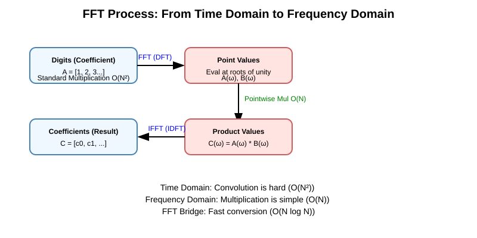
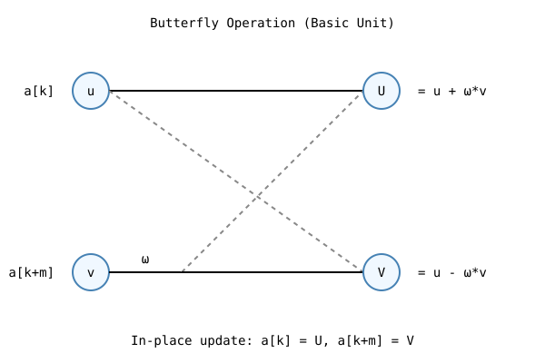

# High-Precision Multiplication with FFT | FFT 高精度乘法

[English Version](#english-version) | [中文版本](#chinese-version)

---

## English Version

### 1) Problem Statement and Scale
We need to multiply two non-negative integers $A$ and $B$, each up to $10^6$ digits.

- Naive multiplication: $O(N^2)$
- FFT-based multiplication: $O(N\log N)$

At this scale, $O(N^2)$ is impractical while FFT is feasible.

### 2) Intuition: Two Worlds
Big-integer multiplication is hard in coefficient form, but easy in value form.

1. **Coefficient domain**: arrays of digits / blocks; multiplication is convolution.
2. **Frequency domain**: values at roots of unity; multiplication becomes point-wise.
3. **Inverse transform**: recover coefficients, then perform carry normalization.

This is exactly the convolution theorem in action.

### 3) Mathematical Foundation (Progressive)

#### Layer A: Integer as Polynomial
Write digits in reverse order:

$$
A = \sum_{i=0}^{n-1} a_i 10^i,\quad B = \sum_{j=0}^{m-1} b_j 10^j
$$

Then product coefficients before carry are:

$$
c_k = \sum_{i+j=k} a_i b_j
$$

So multiplication reduces to convolution.

#### Layer B: DFT / FFT
Let $\omega_n = e^{2\pi i/n}$.

DFT evaluates polynomial at $1,\omega_n,\omega_n^2,\dots,\omega_n^{n-1}$.
The theorem says:

$$
\mathrm{DFT}(a*b)=\mathrm{DFT}(a)\odot\mathrm{DFT}(b)
$$

Hence:
1. FFT on both arrays,
2. multiply point-wise,
3. inverse FFT,
4. round and carry.

#### Layer C: Butterfly Decomposition
FFT uses divide-and-conquer by splitting even/odd indices:

$$
P(x)=P_{even}(x^2)+xP_{odd}(x^2)
$$

This gives iterative stages of length $2,4,8,\dots,n$.

### 4) Full Procedure (Contest-Oriented)
1. Read strings `A`, `B`; strip leading zeros.
2. Convert to reversed digit vectors (or block vectors).
3. Choose `n` as power of two with `n >= lenA + lenB`.
4. Build complex arrays `fa`, `fb`.
5. Iterative FFT(`fa`), FFT(`fb`).
6. Point-wise multiply: `fa[i] *= fb[i]`.
7. Inverse FFT(`fa`).
8. `coef[i] = llround(real(fa[i]))`.
9. Carry propagation in base 10 (or base $10^k$).
10. Remove leading zeros and print.

### 5) Complexity Analysis
If transform length is $n$:

- FFT: $O(n\log n)$
- Point-wise multiply: $O(n)$
- Carry: $O(n)$

Total: $O(n\log n)$.

### 6) Numerical Stability Notes
Because FFT uses floating-point complex numbers:

- always use rounding (`llround`) after inverse FFT,
- choose moderate base per element (digit base 10 is safest, $10^2$ or $10^3$ can be used carefully),
- avoid extremely aggressive base that amplifies precision error.

For fully exact modular arithmetic, NTT is an alternative, but FFT is usually simpler and sufficient for most CP tasks.

### 7) Bit-Reversal and Iterative Cooley-Tukey
Iterative FFT usually has two key parts:

1. **Bit-reversal permutation** (reorder input),
2. **Layered butterfly loops** (length doubling each stage).

This avoids recursion overhead and is cache-friendly.

### 8) Practical Engineering Tips
- Use `std::vector<std::complex<double>>` and reserve enough memory.
- Keep one reusable FFT routine with `invert` flag.
- Handle edge case: if either number is `0`, return `0` immediately.
- Add random small-case validator against $O(N^2)$ for debugging.

### 9) Quick Correctness Checklist
- Leading zeros stripped?
- `n` power-of-two and large enough?
- Inverse FFT divided by `n`?
- Rounding and carry done?
- Final trimming correct?

---

## 中文版本

### 1）问题规模与必要性
任务：计算两个非负大整数 $A\times B$，每个最多 $10^6$ 位。

- 朴素乘法：$O(N^2)$，百万位几乎不可用。
- FFT 乘法：$O(N\log N)$，是竞赛与工程中的主流可行方案。

### 2）直观理解：在两个世界中来回穿梭
在“系数世界”里做卷积很慢，在“点值世界”里逐点相乘很快。

流程：
1. 系数表示（难）
2. FFT 到点值表示（桥梁）
3. 逐点相乘（快）
4. IFFT 回到系数并处理进位

### 3）理论分层（由浅入深）

#### 第一层：整数本质是多项式在 10 点取值

$$
A = \sum_{i=0}^{n-1} a_i10^i,\quad B = \sum_{j=0}^{m-1} b_j10^j
$$

乘积进位前系数：

$$
c_k=\sum_{i+j=k}a_ib_j
$$

这就是卷积。

#### 第二层：为什么 FFT 能加速卷积
卷积定理：

$$
\mathrm{DFT}(a*b)=\mathrm{DFT}(a)\odot\mathrm{DFT}(b)
$$

所以可先做 FFT，再点乘，再逆变换，最终统一进位。

#### 第三层：蝴蝶操作是核心计算单元

$$
P(x)=P_{even}(x^2)+xP_{odd}(x^2)
$$

通过偶奇拆分，把规模不断减半，形成长度 $2,4,8,\dots,n$ 的迭代层。

### 4）完整实现步骤（可直接落地）
1. 读取字符串并去前导零。
2. 倒序存入数组（按位或按块）。
3. 取最小二次幂 `n >= lenA+lenB`。
4. 构造复数数组 `fa`,`fb`。
5. 执行 FFT。
6. 频域逐点相乘。
7. 执行逆 FFT。
8. 实部四舍五入为整数系数。
9. 统一进位。
10. 去掉前导零并输出。

### 5）复杂度说明
设补齐后长度为 $n$：

- FFT / IFFT：$O(n\log n)$
- 逐点相乘：$O(n)$
- 进位：$O(n)$

总复杂度：$O(n\log n)$。

### 6）精度与误差处理
复数 FFT 使用浮点计算，误差不可避免：

- 逆变换后必须 `llround`，
- 建议基数不要过大（按十进制位最稳），
- 若追求严格整数域无误差，可考虑 NTT。

### 7）位逆序与迭代 FFT 细节
高性能实现常见两步：
1. 位逆序重排（Bit-Reversal）
2. 分层蝶形合并（长度倍增）

这种写法比递归更利于缓存和常数优化。

### 8）工程实践建议
- 统一封装一个 `fft(vector<complex<double>>&, bool invert)`。
- 对零输入快速返回。
- 对小数据做随机对拍（与朴素乘法比对）。
- 大输入时尽量预分配内存，减少扩容开销。

### 9）自查清单
- 链接长度 `n` 是否正确？
- 逆变换后是否除以 `n`？
- 是否做了四舍五入与进位？
- 是否正确去除前导零？

---

[回到顶部 / Back to Top](#high-precision-multiplication-with-fft--fft-高精度乘法)